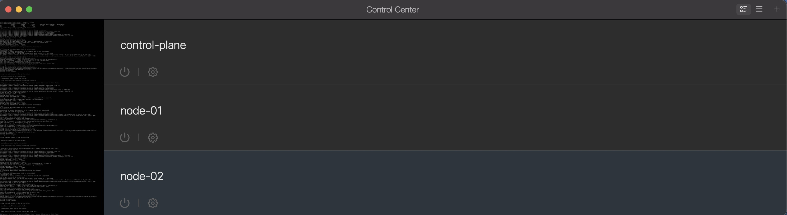

## Cluster Creation
**Summary:** Create VMs via Parallels Desktop, create three node cluster via kubeadm, join worker nodes to controlplane node, install Helm

- 2026-01-10 Install Ubuntu Server on all three VMs - configure hostname and IP, validate connectivity to other VMs.
  
- 2026-01-10 Install containerd on node01 and validate running.
  
- 2026-01-10 Install containerd on node02 and validate running.
  
- 2026-01-10 Install containerd on controlplane and validate running.
  
- 2026-01-10 Validate ssh functional from MacBook to ControlPlane node.
  
- 2026-01-10 Validate ssh functional from MacBook to worker node node-01.
  
- 2026-01-10 Validate ssh functional from MacBook to worker node node-02.
  
- 2026-01-10 Successfully initialize the control-plane node.
  
- 2026-01-10 TROUBLESHOOTING: Current containerd version installed is not compatible with control plane - update to 2.2.1.
  
  
- 2026-01-10 Joined both worker nodes to the control-plane node and validate.
  
- 2026-01-10 Install Helm and validate installed version.
  

## Cilium
**Summary:** Installation and validation of Cilium on controlplane node. Installation and configuration of Hubble. Create and apply CNP. Enforce and validate policies.
- 2026-01-11 Remove kubeproxy, install Cilium validate install health, validate all nodes are ready and no kubeproxy pods present in kube-system namespace.
  
- 2026-01-11 TROUBLESHOOTING: Cilium test completed - broken originally - had to force tunneling by pinning to the interface in use by the cluster.
  
- 2026-01-11 Validate Hubble installed - pods ready and up - architecture is correct for ARM silicon then validate installed version.
  
- 2026-01-11 Validate can filter for DROPPED traffic via hubble.
  
- 2026-01-11 Invoke Cilium dbg utility via one of the Cilium pods and inspect endpoint ingress/egress policy enforcement.
  
- 2026-01-11 Edge namespace hubble UX observability validated.
  
- 2026-01-11 Client namespace hubble UX observability validated.
  
- 2026-01-11 Backend namespace hubble UX observability validated.
  
- 2026-01-11 Validate hubble observe functionality and flows are being captured.
  
- 2026-01-11 Validate hubble observe is properly logging traffic.
  
- 2026-01-11 Validate all Cilium Network Policies are active in cluster and properly namespaced-scoped, including zero trust.
  
- 2026-01-11 Validate Cilium Network Policies are being enforced after validating namespace scoping.
  

## Key Lessons Learned
- Cilium CNP enforcement is namespace-scoped and silently fails if misapplied
- Hubble CLI requires relay port-forward even when UI is accessible
- Native vs tunneling routing must match underlying interface reality
- EndpointSelector precision directly impacts enforcement visibility
